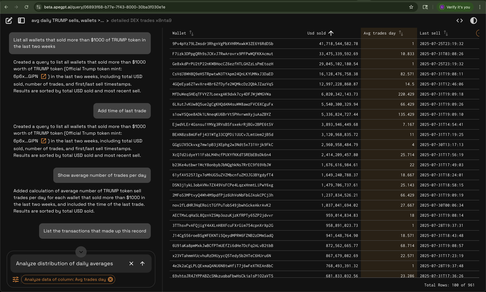

## TL;DR

Semantic Grid is an open-source interface that lets users explore complex datasets using natural language — no SQL or rigid filters required. Instead of pre-built dashboards with fixed views, users describe what they want to see. The system builds live, interactive tables in response.

[](https://semanticgrid.ai)

## Built for Analytics Teams

Most BI tools bury business users under hundreds of dashboards yet still fail to deliver clear answers. As a result, users constantly ping data teams to tweak or rebuild dashboards. It’s no surprise — business needs change, data priorities shift, and there are infinite ways to slice information.

Semantic Grid integrates with existing BI tools (like Superset, Tableau, and Looker) but empowers business users to instantly create or fork dashboards, visualize data in tables, and generate new, derivative versions using simple natural language.

## How It Works

1. **Start with existing chart or create brand new prompt**  
   “Show me all new subscribers we got yesterday”  

2. **Click [Edit with AI] to enter Semantic Edit mode**  
   Data behind chart is represented in tabular format  

3. **Iterate on tabular data using natural langague prompts to get to the desired view**  
   Pass context by highlighting rows, columns and cells
   Prompts, queries, and tables are versioned and sharable 

4. **Save desired view as new chart that you can always come back to**
   Aggregate forked charts into own, custom dashboards 
     
  
*[Watch Demo Video](https://youtu.be/5ySluirKR_M)*


## Getting Started

- [Read the Docs](docs/systems-architecture.md)
- *[Watch Demo Video](https://youtu.be/5ySluirKR_M)*
- [Join Discord](https://discord.gg/9bsR6sU7JQ)
- Deploy using Helm (bring your own compute)
- Plug in your foundation model (OpenAI, local models, etc.)
- Connect to your dataset and describe it using metadata + sample queries

# Building

## fm-app

```bash
docker buildx build --platform linux/amd64 -f apps/fm-app/Dockerfile -t <your org repo>/fm_app:latest .
```

## db-meta

```bash
docker buildx build --platform linux/amd64 -f apps/db-meta/Dockerfile -t <your org repo>/dbmeta:latest .
```

## web (UI)

```bash
docker buildx build --file apps/web/Dockerfile -t <your org repo>/web:latest .
 ```
